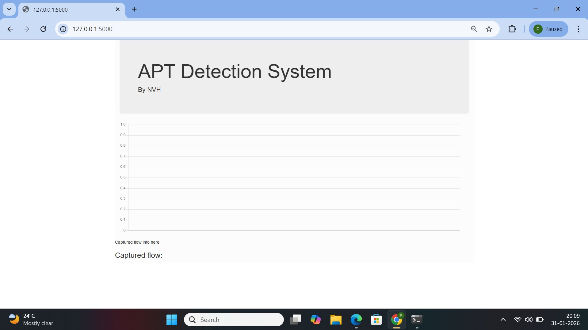

# Intrusion Detection System (IDS) Project

This project demonstrates a basic Intrusion Detection System using network security tools.

## Tools Used
- Nmap
- Wireshark
- Snort

## Project Description
The project focuses on monitoring network traffic and identifying malicious activities.  
Nmap was used for network scanning, Wireshark for packet analysis, and Snort for intrusion detection.

## Features
- Network scanning
- Packet capturing
- Detection of suspicious activities

## Outcome
Successfully detected abnormal traffic patterns and potential attacks in the network.

## Project Output
APT Detection System Interface

